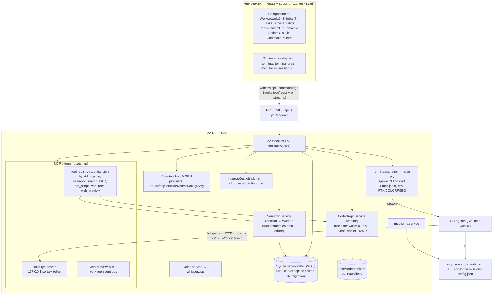

# OXESpace — Arquitetura

> Análise do estado atual (branch `codex/workspace-customization-release`). Números medidos via `git ls-files`/`wc`.

OXESpace é um **app Electron** (3 processos) que funciona como um *terminal manager multi-agente*: orquestra CLIs de IA (Claude, Copilot, Codex, Cursor, Antigravity) em panes e oferece a eles **retrieval local** (Semantic + CodeGraph) através de um **servidor MCP interno**.

## Números (LOC reais)

| Camada | Arquivos | LOC |
|---|--:|--:|
| `electron/main` (inclui CodeGraph vendado ~40k) | 194 | 54.749 |
| └ código próprio do main (ex-vendor) | ~67 | ~14.8k |
| `electron/main/vendor/codegraph` | 127 | 39.981 |
| `src` (renderer) | 110 | 19.479 |
| `shared` (tipos/contratos) | 22 | 2.184 |
| `electron/preload/api.ts` | 1 | 263 |

**Inventário:** 38 services · 22 módulos IPC · 21 stores Zustand · 37 migrations SQL · 21 grupos de componentes · 1 worker (semantic) · MCP interno (7 arquivos).

## Diagrama (Mermaid)



## Diagrama (ASCII — fallback)

```
RENDERER (React/Zustand) ──window.api(contextBridge)──► PRELOAD(api.ts) ──ipcRenderer──► MAIN
MAIN:
  22 IPC → 38 services
   ├ TerminalManager → node-pty → spawn CLI (cwd com .mcp.json)
   ├ Agentes/Sessão/Skill (providers por CLI)
   ├ Integrações (github/git/rtk/usage/oxe)
   ├ MCP interno: local-rpc(127.0.0.1:porta+token) ◄─ bridge cjs ◄─ CLI agente
   │    tool-handlers → SemanticService.query  +  CodeGraphService.explore
   ├ SemanticService → Worker(transformers e5-small) → semantic_embeddings (SQLite)
   ├ CodeGraphService(vendor tree-sitter) → .oxe/codegraph.db
   └ SQLite(better-sqlite3, WAL) global + voice→whisper
  mcp-sync escreve .mcp.json / ~/.claude.json / ~/.copilot ► lidos pelos CLIs
```

## Camadas

1. **Renderer (React/Zustand)** — grade de panes, sidebar de workspaces, chips de status (GitHub/MCP/RTK/Caveman/Semantic), Tasks/Review/Editor, Command Palette, painéis MCP/Semantic. 21 stores; `terminal-prefs.store` (persistido) guarda os toggles opt-in (RTK/Caveman/Semantic) por workspace.
2. **Preload (`api.ts`)** — única ponte: `contextBridge.exposeInMainWorld('api', …)` sobre `ipcRenderer.invoke` (req/resp) e `ipcRenderer.on` (streams: bytes do pty, health do MCP, logs do Semantic). Isola o renderer do Node.
3. **Main (Node)** — boot em `index.ts` (`app.whenReady → registerIpcHandlers`): `openDatabase` (better-sqlite3 + WAL + 37 migrations) → `TerminalManager` → `SemanticService` → registra os 22 IPCs → `BackgroundManager`/`McpManager`/skill/session → **MCP interno** (`createInternalMcpHandle` com db/mcpManager/workspace/github/background/fileSystem/semantic/codegraph → `start()`) → `createMainWindow`.

## Subsistemas-chave

- **Terminais/Agentes** — `TerminalManager` spawna o CLI via `node-pty` no `cwd` do workspace (onde o `.mcp.json` existe), injetando env (PATH do RTK, `COLORFGBG`, etc.). Cada provider define comando + perfil de shell.
- **MCP interno** — servidor RPC local autenticado (porta+token persistidos em `internal_mcp_meta`); `mcp-sync` materializa `<workspace>/.mcp.json` **e** as aprovações em `~/.claude.json` (`enabledMcpjsonServers`) e `~/.copilot/permissions-config.json`. O CLI agente spawna o **bridge cjs** → HTTP → `local-rpc-server` → `tool-handlers`. `oxespace_hybrid_explore` = Semantic (união) + CodeGraph.
- **Semantic** — `chokidar` observa o repo → fila serializada → **Worker thread** (`semantic-worker.ts`, `transformers.js` e5-small bundled/offline) → tabela `semantic_embeddings`; query por cosseno (best-chunk).
- **CodeGraph (vendado)** — `tree-sitter` (wasm 0.25.9) num parse-worker → grafo AST em `.oxe/codegraph.db` (better-sqlite3, fallback `node:sqlite`); ranking Random-Walk-with-Restart + "blast radius".
- **Persistência** — SQLite global (`<userData>/oxespace.sqlite3`) para estado do app; `.oxe/codegraph.db` por repositório.
- **Build** — `electron-vite` (3 bundles: main/preload/renderer) + plugin que copia wasm/schema/modelo p/ `out/main`; `electron-builder` (NSIS) com `asarUnpack` dos nativos (better-sqlite3, node-pty, onnxruntime, web-tree-sitter, tree-sitter-wasms).

## Fluxos principais

- **Spawn de pane:** renderer → `terminal.ipc` → `TerminalManager` → `node-pty` (CLI no cwd). O manifesto de contexto OXE é prefixado no prompt inicial.
- **Tool MCP:** CLI lê `.mcp.json` (já aprovado) → spawna bridge → HTTP autenticado → `tool-handlers` → `semantic.query` / `codegraph.explore` / jobs / worktrees / web preview.
- **Indexação semântica:** toggle no chip → `SemanticService.setEnabled` → chokidar → worker → embeddings no SQLite.
- **CodeGraph:** lazy na 1ª `hybrid_explore` → parse-worker indexa → `.oxe/codegraph.db`.

## Observações arquiteturais

**Forças**
- Separação de processos limpa; preload como **única** superfície renderer↔main.
- MCP interno **desacoplado**: qualquer CLI que leia `.mcp.json` ganha as tools (Claude, Copilot…).
- Retrieval pesado isolado em **workers** (não bloqueia main/UI).
- Recursos **opt-in por workspace** (RTK/Caveman/Semantic).

**Riscos / dívidas**
- CodeGraph vendado é ~73% do `main` → acoplamento a `web-tree-sitter` 0.25.x (exigiu shim de tipos `extraction/syntax-node.ts`).
- ABI nativa frágil (`npm run fix:native` após `npm install`).
- MCP interno depende de porta/token sincronizados no `.mcp.json` (endurecido: re-sync a cada start).
- `index.ts` concentra muito wiring (851 LOC) → candidato a um container de injeção de dependências.
