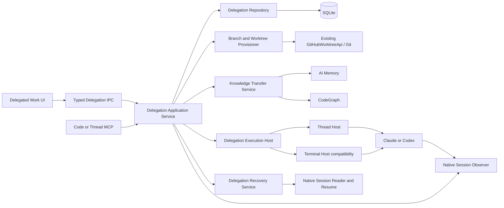
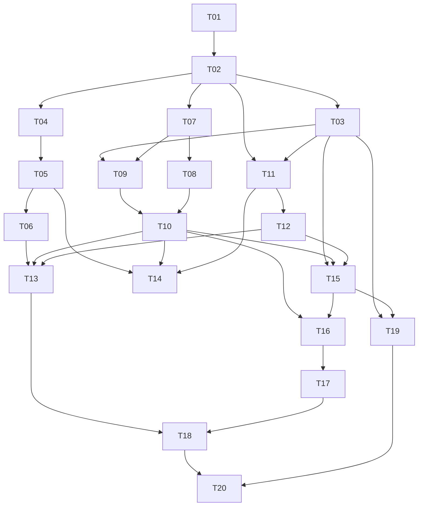

# Delegação persistente por worktree e branch — plano de implementação

Data: 2026-09-21
Estado: implementação funcional em validação; certificação Claude pendente
Escopo: Agent Delegation a partir de Code ou Thread, Claude e Codex, branches e worktrees locais, AI Memory e retomada após reinício
Fora do escopo: integração com Azure DevOps, Jira, GitHub Issues ou qualquer outro gerenciador de trabalho

## Autoavaliação do Plano

- Melhor plano atual: sim
- Confiança: 95%
- Execução: modo completo, 20 tarefas em 6 ondas
- Hipóteses críticas: sintaxe nativa de resume por versão será comprovada em T01; terminal sem boundary confiável permanece `handoff-only`

## Estado da execução em 2026-09-21

T02–T17 estão implementadas no checkout atual, com contratos, migração v57, Git reentrante, lease da Thread, vínculo nativo, pacote versionado, central Code/Thread e ações distintas de retomada. T01 está parcialmente verificada; T18–T20 continuam em verificação. Os testes automatizados e o piloto Codex estão registrados em [EVIDENCE.md](EVIDENCE.md). O piloto Claude autenticado parou na primeira interação por falha de autenticação; não há certificação de paridade de retomada desse provider até repetir o piloto com uma conta autenticada. Não foi adicionada integração com gerenciador de trabalho.

## 1. Objetivo

Permitir que uma sessão do OXESpace delegue trabalho para outra sessão independente sem trocar a branch do checkout de origem. O destino deve usar uma worktree persistente na branch escolhida pelo usuário, receber conhecimento suficiente para continuar o trabalho e poder ser retomado de forma determinística depois que o aplicativo for fechado.

O fluxo concluído deve ser:

```text
Sessão de origem em Code ou Thread
  → escolher agente e destino
  → usar branch existente, criar branch com nome exato ou gerar por template local
  → criar/reutilizar worktree sem alterar a branch da origem
  → iniciar uma nova sessão Claude/Codex vinculada à tarefa
  → transferir handoff versionado + contexto selecionado + AI Memory
  → fechar o OXESpace
  → abrir o OXESpace
  → clicar em Continuar
  → validar branch/worktree e retomar o ID nativo exato da sessão de destino
```

A sessão de destino continua sendo independente da origem. O plano transfere conhecimento e preserva o vínculo com a sessão nativa do destino; não tenta clonar estado interno do modelo nem executar a mesma sessão simultaneamente em dois processos.

## 2. Resultado da auditoria atual

| Dimensão | Estado atual | Lacuna |
|---|---|---|
| Isolamento Git | Worktree e branch próprias | Branch sempre `oxe/<slug>-<id>` |
| Base da branch | SHA do `HEAD` do destino | Sem branch/base explícitos e sem tracking remoto |
| Conhecimento | Handoff, aceite, evidência commitada, Memory e CodeGraph opcionais | Sem pacote versionado, checkpoint ou resumo revisável |
| Persistência | Tarefa, eventos, resultados, branch e worktree em SQLite | Sessão nativa não está vinculada à tarefa |
| Restart | Código e worktree permanecem; tarefa vira `interrupted` | Retry inicia outro processo sem resume exato |
| Origem Code | ExecutionRegistry e MCP autenticados | Reconexão fica enterrada em Settings |
| Origem Thread | Ferramentas aparecem no catálogo | Thread não recebe lease de execução exigido pela delegação |
| Descoberta | Tarefas em Workspace Settings | Sem central pesquisável por branch, tarefa ou estado |
| Desempenho | Limites de 4 tarefas por projeto e 12 globais | `all()` carrega e desserializa todas as tarefas em consultas comuns |

Evidência principal no checkout atual:

- `shared/types/delegation.ts`: entrada sem intenção de branch ou sessão nativa.
- `electron/main/services/delegation.service.ts`: branch gerada, worktree, lifecycle, retry e persistência.
- `electron/main/services/agent-launch.service.ts`: sempre inicia uma sessão nova.
- `electron/main/services/conversation/thread-mcp.ts`: expõe as ferramentas de delegação.
- `electron/main/index.ts` e `process-transport.ts`: Thread não recebe credenciais do ExecutionRegistry.
- `memory-project.service.ts`: worktrees do mesmo repositório compartilham identidade por `git-common-dir`.
- `WorkspaceDelegationSettings.tsx`: recuperação e tarefas ficam dentro de Settings.

## 3. Escopo funcional

### Incluído

1. Origem em Code ou Thread.
2. Destino em Thread persistente por padrão, com terminal Code mantido como superfície compatível.
3. Três estratégias genéricas de branch:
   - `existing`: usar uma branch local/remota existente;
   - `create`: criar uma branch com nome exato informado;
   - `generated`: gerar um nome a partir de campos genéricos e template local.
4. Base explícita e fetch opcional antes da criação.
5. Reutilização deliberada de worktree já existente.
6. Vínculo durável entre tarefa, worktree, branch, superfície e sessão nativa.
7. Retomada exata da sessão nativa Claude/Codex quando disponível.
8. Fallback explícito para nova sessão usando o último handoff/checkpoint.
9. Pacote de transferência de conhecimento versionado e revisável.
10. Central de delegações no modo Thread e acesso equivalente no Code.
11. Migração compatível com tarefas legadas.
12. Fault injection, testes de concorrência, segurança, desempenho e pilotos autenticados.

### Fora do escopo

- Consultar ou atualizar cards em serviços externos.
- Inferir branch por URL de Azure DevOps, Jira, Linear ou GitHub.
- Push, pull request, merge, rebase ou remoção automática de worktrees.
- Delegação recursiva automática.
- Retomar a sessão nativa da origem dentro do destino.
- Transferir pensamento privado, credenciais, transcript bruto ou conteúdo dirty sem seleção e consentimento.
- Relançar agentes automaticamente durante o boot.
- Escolher a sessão “mais recente” como heurística de resume.

Integrações existentes, como Linear, podem futuramente produzir o mesmo `DelegationBranchIntent`, mas não serão alteradas por este ciclo.

## 4. Princípios e invariantes

1. A branch da origem nunca é alterada pela delegação.
2. Toda mutação Git é precedida por preflight e revalidada imediatamente antes do efeito.
3. O nome da branch é validado por `git check-ref-format --branch`; sanitização nunca muda silenciosamente um nome explícito.
4. Uma branch já aberta em outra worktree só pode ser reutilizada com escolha explícita do usuário.
5. Worktree, branch e `git-common-dir` precisam corresponder ao projeto persistido antes de iniciar ou retomar um agente.
6. Cada agente mantém sua própria sessão nativa. Um mesmo ID nativo não pode ter dois writers locais.
7. Resume usa somente um ID nativo persistido e validado para provider e root exatos; nunca usa “latest”.
8. Retry significa repetir provisionamento idempotente. Resume significa continuar uma sessão conhecida. As ações não são sinônimas.
9. O boot reconcilia e apresenta estado; nunca relança trabalho automaticamente.
10. AI Memory é contexto histórico compartilhado por projeto, não substituto de vínculo de sessão.
11. Falha opcional de Memory ou CodeGraph não bloqueia uma delegação cujo handoff explícito é válido.
12. Toda operação durável recebe `taskId`, `operationId`, `generation`, timestamps e estado terminal ou `unknown`.
13. O renderer nunca executa Git, escolhe caminhos canônicos ou manipula tokens diretamente.
14. Logs e diagnósticos registram IDs e estados, mas não prompts, credenciais ou conteúdo integral do handoff.

## 5. Arquitetura-alvo



### Responsabilidades

- **DelegationApplicationService**: comandos de alto nível, autorização, idempotência e transações de lifecycle.
- **DelegationRepository**: consultas indexadas, compatibilidade de payload legado e persistência atômica.
- **DelegationGitPlanner**: resolve a intenção para um plano sem efeitos.
- **DelegationGitProvisioner**: executa o plano revalidado e grava recibos por etapa.
- **KnowledgeTransferService**: cria revisões imutáveis do pacote de contexto.
- **DelegationExecutionHost**: interface para iniciar, retomar, parar e inspecionar uma execução.
- **NativeSessionObserver**: recebe boundaries confiáveis do provider independentemente de AI Memory e publica o vínculo exato para delegation e memory.
- **ThreadDelegationHost**: destino padrão, com Thread persistente e `nativeSessionId` já suportado pelo runtime.
- **TerminalDelegationHost**: compatibilidade com tarefas e perfis Code existentes.
- **DelegationRecoveryService**: reconcilia banco, worktree, processo e sessão nativa após falha/restart.

`DelegationService` permanece inicialmente como fachada e é reduzido gradualmente. Nenhuma onda deve fazer uma reescrita total em uma única alteração.

## 6. Contratos propostos

```ts
export type DelegationBranchStrategy = 'existing' | 'create' | 'generated'

export interface DelegationBranchIntent {
  strategy: DelegationBranchStrategy
  name?: string                 // obrigatório para existing/create
  baseRef?: string              // somente create/generated
  fetchBase?: boolean           // nunca implícito
  remote?: string               // tracking opcional de branch remota
  reuseExistingWorktree?: boolean
  workLabel?: string            // texto genérico para {slug}
  reference?: string            // referência genérica para {reference}
  template?: string             // override local; não consulta serviços externos
}

export interface ResolvedDelegationCheckout {
  strategy: DelegationBranchStrategy
  branch: string
  baseRef: string | null
  baseSha: string
  remoteRef: string | null
  worktreePath: string
  reuseExistingWorktree: boolean
  createBranch: boolean
  fetchBase: boolean
}

export type DelegationSurface = 'thread' | 'terminal'

export interface DelegationSessionBinding {
  taskId: string
  role: 'origin' | 'destination'
  surface: DelegationSurface
  ownerId: string              // threadId ou paneId
  provider: 'claude' | 'codex'
  nativeSessionId: string | null
  projectId: string
  rootPath: string
  generation: number
  state: 'starting' | 'active' | 'interrupted' | 'resumable' | 'closed' | 'unknown'
}

export interface KnowledgeTransferBundleV1 {
  schemaVersion: 1
  taskId: string
  objective: string
  acceptance: string
  source: { workspaceId: string; rootPath: string; branch?: string; provider?: string }
  destination: { workspaceId: string; rootPath: string; branch: string; baseSha: string }
  summary: string
  decisions: string[]
  failedApproaches: string[]
  nextSteps: string[]
  openQuestions: string[]
  files: Array<{ path: string; commit?: string; sha256?: string; purpose?: string }>
  verification: string[]
  memorySources: string[]
  createdAt: number
}
```

### Template de branch

O default permanece compatível:

```text
oxe/{slug}-{shortId}
```

O usuário pode configurar, por projeto, algo como:

```text
feature/{reference}-{slug}
```

Placeholders suportados:

- `{slug}`: derivado de `workLabel` ou objetivo;
- `{reference}`: referência textual opcional fornecida pelo usuário;
- `{shortId}`: oito caracteres do task ID;
- `{date}`: data local `YYYYMMDD`.

Template com placeholder ausente falha no preflight. O sistema mostra o nome final antes de criar a branch.

## 7. Resolução de branch e worktree

| Entrada | Resolução esperada |
|---|---|
| `existing` + branch local livre | Criar worktree usando a branch existente |
| `existing` + branch já aberta | Reutilizar o path somente com `reuseExistingWorktree=true`; caso contrário, conflito informativo |
| `existing` + branch apenas remota | Criar branch local tracking da remota após confirmação/fetch opcional |
| `create` + nome inexistente | Criar a branch a partir do `baseRef` resolvido e criar worktree |
| `create` + nome existente | Falhar e oferecer mudar para `existing`; nunca sobrescrever |
| `generated` | Renderizar template, validar e seguir o fluxo de `create` |
| base omitida | Usar `resolveWorktreeBase`, nunca herdar silenciosamente uma feature branch do checkout principal |
| fetch solicitado e falha | Exibir base possivelmente desatualizada e exigir decisão antes de continuar |

O preflight retorna plano, efeitos, conflitos e warnings sem criar recursos. A execução repete as verificações dentro do lock por projeto. Cada etapa grava receipt durável: `branch-resolved`, `branch-created|branch-reused`, `worktree-created|worktree-reused`, `checkout-verified`.

## 8. Persistência e migração

Usar a próxima migração livre no início da execução; no checkout auditado é `057_delegation_continuity.sql`.

Estruturas propostas:

1. **Índice consultável de tarefas**: projeto, origem, destino, estado, branch e `updated_at`, evitando `SELECT payload FROM delegations` em todas as consultas.
2. **`delegation_checkouts`**: intenção solicitada, plano resolvido, SHA base, path, branch criada/reutilizada e receipts Git.
3. **`delegation_sessions`**: role, surface, owner ID, provider, native ID, root, geração, estado e último heartbeat.
4. **`delegation_handoff_revisions`**: revisão, schema, hash e bundle JSON imutável.
5. **Índices** por projeto/estado/update, workspace/estado, task/generation e provider/native ID.

Regras de migração:

- tarefas legadas recebem estratégia `generated`, branch/path atuais e `nativeSessionId=null`;
- nenhuma tarefa é relançada durante a migração;
- payload legado continua legível durante uma versão de compatibilidade;
- repositório central impede dual writes divergentes;
- banco existente recebe backup pelo mecanismo já presente;
- downgrade não apaga tabelas novas; a versão anterior apenas ignora os dados adicionais;
- contagem, task IDs, branches e estados são comparados antes/depois em testes de fixture.

## 9. Identidade de execução e MCP da Thread

Generalizar `ExecutionRegistry` para owner discriminado:

```ts
type ExecutionOwner =
  | { kind: 'pane'; paneId: string }
  | { kind: 'thread'; threadId: string }
```

O registro mantém workspace, cwd, project identity, token, geração e policy. Métodos antigos `forPane` continuam como adapter temporário.

No modo Thread:

1. `mcp.prepare(thread)` registra lease `owner={kind:'thread'}`.
2. Main devolve execution ID/token junto do lease MCP e Memory.
3. `subscriptionEnvironment` continua removendo qualquer `OXESPACE_*` herdado.
4. `AgentProcessTransport` aceita execution ID/token somente do objeto fresco retornado pelo main.
5. `mcp.end(threadId)` revoga execução e finaliza Memory mesmo em erro de dispose.
6. Um teste chama `oxespace_delegate_task` através do bridge/local RPC real da Thread; listar a ferramenta não é prova suficiente.

## 10. Vínculo e retomada da sessão nativa

### Captura

- Thread: usar o `nativeSessionId` emitido pelo adapter e persistido no thread store.
- Terminal: extrair uma observação mínima de sessão dos adapters/hooks para um `NativeSessionObserver` do OXESpace, independente de AI Memory. O `MemoryService` passa a ser consumidor opcional dessa boundary; `DelegationSessionBinder` é outro consumidor.
- Se uma versão do provider não oferecer boundary confiável no terminal, o terminal host fica explicitamente `handoff-only`; o sistema não tenta compensar procurando a sessão mais recente. O Thread host permanece o caminho certificado para resume.
- Não analisar scrollback nem procurar a sessão mais nova.

### Resume

1. Adquirir lease exclusivo por `provider + nativeSessionId + canonicalRoot`.
2. Validar projeto, worktree, branch e root da sessão.
3. Validar que o ID pertence ao provider esperado.
4. Incrementar a geração da execução.
5. Thread host usa os adapters de resume existentes.
6. Terminal host usa argumentos nativos certificados por provider/versão.
7. Se o provider negar ou o histórico não existir, marcar `handoff-only` e oferecer nova sessão com o último bundle.

Estados de recovery:

- `live`: apenas abrir a superfície existente;
- `resumable`: processo ausente e native ID validável;
- `handoff-only`: worktree e bundle existem, native ID ausente/inválido;
- `checkout-conflict`: path, branch ou projeto divergiram;
- `unknown`: resultado de uma operação externa não pode ser provado.

O usuário escolhe a ação em todos os estados, exceto `live`, que apenas foca a sessão existente.

## 11. Transferência de conhecimento

O bundle é produzido na origem, mostrado para revisão e congelado antes do launch. Ele combina:

- objetivo e critérios de aceite;
- resumo público da conversa ou handoff manual;
- decisões, tentativas falhas, próximos passos e perguntas;
- branch/root/commit de origem e destino;
- arquivos selecionados e hashes de evidência commitada;
- estado Git dirty apenas como metadado, sem conteúdo implícito;
- testes/verificações já executados;
- contexto relevante do AI Memory e CodeGraph com fontes e limites.

Limites iniciais:

- bundle serializado: 64 KiB;
- handoff manual: 16 mil caracteres;
- até oito arquivos de evidência e 64 KiB de texto commitado;
- Memory: 4 mil caracteres;
- CodeGraph: 6 mil caracteres;
- timeout independente de 5 segundos para fontes opcionais.

Durante a execução, o agente grava checkpoints estruturados em vez de substituir somente `lastReport`. Cada checkpoint contém resumo, progresso, arquivos, testes, bloqueios e próxima ação. O fallback após falha usa a última revisão confirmada.

## 12. Experiência de produto

### Criação

Um diálogo único, disponível em Code e Thread:

1. Objetivo e aceite.
2. Agente, modelo/esforço quando suportado e superfície de destino.
3. Workspace/repositório de destino.
4. Estratégia de branch.
5. Nome exato ou preview do template.
6. Base/fetch/reuso de worktree.
7. Conteúdo do handoff e evidências.
8. Preflight com branch, path, SHA base, efeitos e warnings.

### Central “Delegated work”

Agrupar por projeto e branch, com busca por objetivo, branch e task ID. Cada item mostra:

- objetivo;
- provider/modelo;
- branch e worktree;
- origem → destino;
- estado da tarefa e da sessão;
- último checkpoint e horário;
- arquivos alterados/testes quando informados;
- task ID, native session ID e path em Details.

A ação principal depende do estado: `Open`, `Continue`, `Review`, `Resolve conflict` ou `Inspect failure`. Ações secundárias incluem mensagem, copiar IDs/path, cancelar, aprovar e retry de provisionamento.

### Comandos

- `/delegations`: abre/lista tarefas conhecidas no projeto.
- `/delegation <taskId>`: abre detalhes.
- `/resume` continua tratando conversas; itens vinculados exibem branch e task ID para eliminar ambiguidade.

Settings permanece responsável por opt-in, destinos autorizados, template de branch e limites. Operação diária sai de Settings.

## 13. Ondas e tarefas

### W0 — Contratos, probes e baseline

#### T01 — Congelar invariantes e executar probes nativos

- Tipo: research/test; esforço: médio; dependências: nenhuma.
- Confirmar sintaxe e comportamento de start/resume de Claude e Codex instalados, root validation, saída de sessão e erros de ID inexistente.
- Criar fake CLIs determinísticos para os mesmos cenários sem chamadas ao modelo.
- Medir criação, restart, status de 1/100/1000 tarefas e bundle máximo.
- Aceite: matriz por provider/versão e fault corpus versionados; nenhum comportamento depende de “latest”.
- Alvos: `tests/fixtures/agents/`, `tests/integration/agent-launch.native.test.ts`, novo `tests/integration/delegation-native-session.test.ts`, `docs/plans/delegation-worktree-continuity/PROTOCOL.md`.
- Verificação: testes de fixture; probes nativos gated por variável de ambiente.

#### T02 — Versionar contratos de branch, sessão e bundle

- Tipo: design/implement; esforço: médio; dependência: T01.
- Adicionar tipos v2 sem quebrar payloads v1; separar request, plano resolvido e estado observado.
- Definir erros estáveis para branch inválida, conflito de worktree, base ausente, sessão ocupada e fallback necessário.
- Aceite: roundtrip JSON; rejeição de campos desconhecidos no MCP/IPC; compatibilidade de leitura v1.
- Alvos: `shared/types/delegation.ts`, `shared/types/ipc.ts`, `electron/main/mcp-internal/delegation-tools.ts`, novos parsers de delegation.
- Verificação: testes de contrato e schemas.

#### T03 — Implementar migração e DelegationRepository

- Tipo: implement/migration; esforço: alto; dependência: T02.
- Criar tabelas/índices, backfill e repository transacional; eliminar consultas comuns que desserializam todas as tarefas.
- Aceite: fixtures v48/v52/v56 migram sem perda; tarefas legadas continuam visíveis; status por projeto usa índice.
- Alvos: próxima migração livre, `electron/main/db/index.ts`, novo `delegation.repository.ts`, `tests/integration/migrations.test.ts`.
- Verificação: migração em arquivo real temporário, contagem/hash e query plan.

### W1 — Branch e worktree genéricas

#### T04 — Criar BranchTemplate e validação de refs

- Tipo: implement; esforço: médio; dependência: T02.
- Renderizar placeholders, validar nome explícito sem alteração silenciosa e limitar path no Windows.
- Aceite: Unicode/whitespace, refs inválidas, placeholders ausentes, colisões e paths longos cobertos.
- Alvos: novo `delegation-branch.ts`, settings/types e testes unitários.
- Verificação: table tests mais `git check-ref-format` real.

#### T05 — Implementar DelegationGitPlanner e preflight v2

- Tipo: implement; esforço: alto; dependências: T03–T04.
- Resolver branch local/remota, base, worktree existente e conflitos sem efeitos; reutilizar `listBranches`, `listWorktrees` e `resolveWorktreeBase`.
- Aceite: as três estratégias retornam plano determinístico e warnings acionáveis; preflight não altera Git.
- Alvos: novo `delegation-git-planner.ts`, `delegation.service.ts`, `github/repository.service.ts` apenas se faltar operação genérica.
- Verificação: repositórios Git temporários com local, bare remote e múltiplas worktrees.

#### T06 — Executar provisionamento reentrante

- Tipo: implement; esforço: alto; dependência: T05.
- Executar plano sob lock por projeto, revalidar antes de cada efeito e persistir receipts. Retry continua da última etapa comprovada.
- Aceite: cancel/restart em cada etapa não cria segunda branch/worktree; conflito externo vira estado explícito; nenhum checkout de origem muda.
- Alvos: novo `delegation-git-provisioner.ts`, `delegation.service.ts`, `coordination/coordinator.ts`.
- Verificação: fault injection após branch create, worktree add e verify; assert da branch original.

### W2 — Execução autenticada e sessão retomável

#### T07 — Generalizar ExecutionRegistry para pane e Thread

- Tipo: implement; esforço: alto; dependência: T02.
- Introduzir owner discriminado, geração, project identity e revogação por owner; preservar adapters `forPane/end(paneId)` durante compatibilidade.
- Aceite: duas execuções não reivindicam o mesmo owner/native session; token antigo falha após restart/dispose.
- Alvos: `execution-registry.ts`, `tool-registry.ts`, handlers MCP e testes de autorização.
- Verificação: concorrência, timing-safe auth, cross-workspace e generation mismatch.

#### T08 — Entregar lease real de execução à Thread

- Tipo: implement; esforço: alto; dependência: T07.
- Registrar/revogar execução no lifecycle Thread e encaminhar somente credenciais frescas do main pelo ProcessTransport.
- Aceite: `oxespace_delegate_task` executa de verdade a partir de Claude Thread e Codex Thread; env herdado continua removido.
- Alvos: `electron/main/index.ts`, `thread-mcp.ts`, `process-transport.ts`, `thread-runtime.ts`, `tests/thread-mcp-native.test.ts`.
- Verificação: bridge/local RPC real, restart/dispose e teste de não vazamento.

#### T09 — Persistir vínculo exato de sessão nativa

- Tipo: implement; esforço: alto; dependências: T03 e T07.
- Criar observer e binder para boundaries nativas; persistir provider, ID, root, owner, generation e heartbeat. Integrar Thread e hooks/adapters do terminal sem exigir que AI Memory esteja habilitado.
- Aceite: task mostra ID correto; sessão de outro root/provider é rejeitada; nenhum parsing de scrollback; Memory desligado não impede o vínculo quando o provider oferece boundary certificada.
- Alvos: novo `native-session-observer.ts`, `memory.service.ts`, `thread-orchestrator.ts`, novo `delegation-session-binder.ts`, repository.
- Verificação: hooks simulados, IDs concorrentes e restart.

#### T10 — Implementar hosts Thread e Terminal com resume

- Tipo: implement; esforço: alto; dependências: T08–T09.
- Extrair `DelegationExecutionHost`; Thread é default novo, Terminal mantém legado. O Thread host cria uma Thread persistente no root da worktree, aplica provider/modelo/esforço/permissões autorizados e inicia um único turno bootstrap vinculado à tarefa. Implementar start/resume/stop/status por capability real.
- Aceite: mesma sessão nativa volta no mesmo root; bootstrap é enviado uma única vez; perfil/configuração efetiva é visível; falta de capability vira `handoff-only`; sessão live apenas recebe foco.
- Alvos: `agent-launch.service.ts`, novos `thread-delegation-host.ts`, `terminal-delegation-host.ts`, `delegation-recovery.service.ts`.
- Verificação: fake CLIs, native reader e piloto autenticado separado por provider.

### W3 — Conhecimento e coordenação duráveis

#### T11 — Implementar KnowledgeTransferBundle v1

- Tipo: implement; esforço: alto; dependências: T02–T03.
- Montar bundle determinístico com redaction, fontes, hashes e preview. Preservar handoff manual como campo principal.
- Aceite: bundle funciona sem Memory/CodeGraph; limites independentes; transcript privado e dirty contents não entram implicitamente.
- Alvos: novo `knowledge-transfer.service.ts`, `evidence-bundle.ts`, Memory/CodeGraph adapters, UI de preview.
- Verificação: snapshots sem dados privados, source failure matrix e limites.

#### T12 — Persistir checkpoints e comunicação por revisão

- Tipo: implement; esforço: médio/alto; dependência: T11.
- Substituir dependência em `lastReport/lastMessage` por revisões append-only, mantendo campos derivados para compatibilidade.
- Aceite: replay de eventos, checkpoints e resultado sobrevive restart; cursores permanecem por participante; mensagens não acordam agente parado.
- Alvos: repository, coordinator, delegation tools e tipos.
- Verificação: concorrência, ACK perdido, cursor e múltiplas revisões.

#### T13 — Refatorar DelegationService como fachada

- Tipo: implement; esforço: médio; dependências: T06, T10–T12.
- Mover Git, persistência, bundle, host e recovery para serviços dedicados; preservar APIs públicas durante rollout.
- Aceite: lifecycle existente continua passando; nenhuma dependência circular com ThreadManager; fachada concentra somente orquestração.
- Alvos: `delegation.service.ts` e novos módulos de delegation.
- Verificação: suíte de regressão atual e teste de composição.

### W4 — Fluxo profissional de criação e retomada

#### T14 — Criar diálogo de delegação com preflight

- Tipo: implement/UI; esforço: alto; dependências: T05, T10–T11.
- Implementar seleção de branch, preview de template, base, fetch, reuso, superfície e bundle. O mesmo componente serve Code e Thread.
- Aceite: teclado/leitor de tela, erros inline, confirmação dos efeitos e nenhum subprocesso ao apenas abrir o diálogo.
- Alvos: novos componentes `DelegationCreateDialog*`, IPC/preload, design tokens existentes.
- Verificação: React tests e E2E com três estratégias.

#### T15 — Criar central Delegated Work

- Tipo: implement/UI; esforço: alto; dependências: T03, T10, T12.
- Lista paginada/reativa, agrupamento por projeto/branch, busca, detalhes e ação principal por estado. Integrar sidebar Thread e acesso no Code.
- Aceite: 1000 tarefas sem travar UI; task ID/path/native ID copiáveis; nenhuma operação diária exige Settings.
- Alvos: novos `DelegatedWorkPanel.tsx`, `DelegationTaskRow.tsx`, stores/IPC; `ThreadSidebar.tsx`, `Sidebar.tsx`.
- Verificação: performance DOM, keyboard/focus, estados empty/loading/error e E2E.

#### T16 — Separar Open, Continue, Resume e Retry

- Tipo: implement; esforço: alto; dependências: T10 e T15.
- Implementar máquina de decisão de recovery e confirmação para fallback. Reconectar origem deixa de exigir seleção manual quando a própria Thread/pane possui autorização válida.
- Aceite: restart em `preparing/starting/active/blocked/review` apresenta exatamente uma ação segura; nenhum prompt é reenviado automaticamente.
- Alvos: `delegation-recovery.service.ts`, UI, `TerminalPane.tsx`, Thread store/commands.
- Verificação: app restart E2E e fault injection em cada estado.

#### T17 — Adicionar comandos e detalhes de sessão

- Tipo: implement; esforço: médio; dependência: T15.
- Adicionar `/delegations`, detalhes por task ID e metadados na lista `/resume` sem mudar a semântica de resume.
- Aceite: busca por branch/task encontra a sessão correta; comandos não abrem CLI auxiliar nem criam processo ao digitar `/`.
- Alvos: thread command catalog/orchestrator, `ThreadConversationActions`, painéis de detalhes.
- Verificação: testes de comandos, slash UI e navegação.

### W5 — Robustez, desempenho e certificação

#### T18 — Fault suite, segurança e concorrência

- Tipo: test; esforço: alto; dependências: T03–T17.
- Cobrir cancel/restart/crash/revogação em cada fase, branch races, sessão duplicada, route expiry, token antigo, worktree divergente e falhas opcionais.
- Aceite: nenhuma duplicação de branch/worktree/prompt; cross-project fail-closed; código preservado em falhas.
- Alvos: `tests/integration/delegation*.test.ts`, coordination tests, novas fixtures.
- Verificação: execução repetida com seed e relatório de fault matrix.

#### T19 — SLOs e escalabilidade

- Tipo: test/performance; esforço: médio; dependências: T03 e T15.
- Medir status/lista/eventos com 1/100/1000 tarefas e bundles máximos; verificar query plans e renderização.
- Metas iniciais: status de projeto p95 ≤ 50 ms com 1000 tarefas; primeira página UI ≤ 200 ms; update→UI ≤ 250 ms; nenhuma consulta comum faz full JSON scan.
- Aceite: JSON de benchmark versionado e budgets com margem de 5%.
- Alvos: novos benches de delegation, script de budget e E2E de lista.
- Verificação: benchmark Windows de referência e CI sem gate de hardware para métricas absolutas.

#### T20 — Pilotos nativos, documentação e release gate

- Tipo: verify/document; esforço: alto; dependências: T18–T19.
- Executar cenário completo três vezes por Claude/Codex e origem Code/Thread, incluindo restart real. Atualizar documentação e matriz de capabilities.
- Gate: typecheck, lint, migrations, suíte Electron, build/budgets, E2E, quality controller e piloto autenticado documentado.
- Aceite: nenhum P0/P1 aberto; limitações conhecidas publicadas; rollback testado; cinco retomadas consecutivas sem sessão errada.
- Alvos: `docs/AGENT_DELEGATION.md`, `docs/cross-workspace-coordination.md`, `EVIDENCE.md`, CI/E2E.
- Verificação: pipeline completo abaixo.

## 14. Dependências e ordem de entrega



Entregas incrementais:

- **M1 — checkout correto**: T01–T06. Resolve branch genérica e worktree sem tocar na sessão.
- **M2 — continuidade real**: T07–T10. Resolve delegação originada por Thread e resume nativo.
- **M3 — conhecimento durável**: T11–T13. Resolve handoff estruturado e checkpoints.
- **M4 — uso diário**: T14–T17. Resolve descoberta, criação e retomada profissional.
- **M5 — certificação**: T18–T20. Fecha robustez e evidência de release.

Não liberar o novo fluxo por default antes de M2. M1 isolado pode criar a branch correta, mas ainda manteria a principal dor de retomada.

## 15. Critérios de aceite de produto

| ID | Critério |
|---|---|
| A01 | Delegar nunca muda branch, index ou arquivos da origem. |
| A02 | Usuário escolhe branch existente, nome exato novo ou geração por template. |
| A03 | Preview mostra branch/path/base SHA antes do efeito. |
| A04 | Branch já aberta é reutilizada apenas com confirmação explícita. |
| A05 | Origem Code e Thread executam a mesma API autenticada de delegation. |
| A06 | Destino possui sessão nativa própria vinculada à tarefa e ao root exato. |
| A07 | Fechar/reabrir o app oferece Continue sem busca manual em `/resume`. |
| A08 | Continue retoma o native ID exato; nunca escolhe sessão por recência. |
| A09 | Ausência da sessão nativa oferece fallback usando bundle/checkpoint e explica a perda. |
| A10 | AI Memory relevante é compartilhado entre worktrees relacionadas quando habilitado. |
| A11 | Memory/CodeGraph indisponíveis não bloqueiam handoff explícito. |
| A12 | Conteúdo dirty e transcript privado não são transferidos implicitamente. |
| A13 | Retry não reenvia prompt já aceito; resume e retry são ações distintas. |
| A14 | Task ID, provider, native ID, branch, path, origem/destino e último checkpoint são visíveis. |
| A15 | Restart em qualquer fase converge para `live`, `resumable`, `handoff-only`, `checkout-conflict` ou `unknown`. |
| A16 | Cross-workspace consent, limites e revogação atuais permanecem efetivos. |
| A17 | Tarefas legadas continuam acessíveis e recuperáveis por handoff. |
| A18 | 1000 tarefas não causam full scan/parse de todos os payloads em status comum. |
| A19 | Nenhum push, merge, rebase ou delete de worktree ocorre automaticamente. |
| A20 | Claude e Codex passam piloto autenticado de create, close, reopen e continue. |

## 16. Estratégia de testes

### Unitários

- parser e validação de `DelegationBranchIntent`;
- renderização de template;
- state machines de task/session/recovery;
- serialização e redaction do bundle;
- decisão de ação principal da UI;
- compatibilidade de tipos v1/v2.

### Integração com Git real

- branch local existente;
- branch remota tracking;
- criação em base explícita e default branch;
- branch já em outra worktree;
- nomes inválidos e case collisions no Windows;
- restart/cancel entre cada etapa;
- duas solicitações concorrentes com mesma key e keys diferentes;
- origem dirty e destino dirty;
- repositório sem remote e detached HEAD.

### Processo e sessão

- fake Claude/Codex com session-start, resume, missing ID e root mismatch;
- lease Thread através do bridge MCP real;
- duplicate writer lock;
- dispose/crash e token revogado;
- session binding por hook sem Memory ativo como dependência obrigatória;
- fallback handoff-only.

### UI/E2E

- criar delegação nas três estratégias;
- fechar e reabrir Electron;
- Continue, conflito e fallback;
- busca por branch/task;
- 1000 tarefas paginadas;
- teclado, foco, leitor de tela, 900/1280/1440 e light/dark;
- regressão Code e Thread.

### Piloto autenticado

- Claude Code e Codex instalados e autenticados;
- origem Code → destino Thread;
- origem Thread → destino Thread;
- origem Code → destino terminal legado;
- restart durante trabalho e retomada pelo mesmo native ID;
- Memory habilitado e indisponível;
- sem chamadas destrutivas ou publicação remota.

## 17. Comandos de verificação

```powershell
npm run typecheck
npm run lint
node scripts/test-electron.mjs tests/integration/delegation.test.ts tests/integration/coordination.workflow.test.ts
node scripts/test-electron.mjs tests/integration/migrations.test.ts tests/thread-mcp-native.test.ts
node scripts/test-electron.mjs tests/integration/delegation-native-session.test.ts tests/integration/delegation-git-planner.test.ts
npm run test:e2e -- e2e/delegation-worktree-continuity.spec.ts
npm run build
```

Antes de declarar conclusão, executar `oxespace_quality_check` com A01–A20 e revisar todos os achados HIGH. Testes simulados, probes de executável e piloto autenticado são evidências diferentes e devem ser registrados separadamente.

## 18. Riscos e mitigação

| Risco | Mitigação |
|---|---|
| Branch criada a partir da base errada | Base explícita/preview; resolver default remoto; persistir SHA; revalidar antes do efeito |
| Duas tarefas disputarem a mesma branch | Lock por projeto+branch, worktree list sob lock e idempotency key durável |
| Retomar sessão de outro checkout | Binding com provider/root/project/native ID e validação pelo native reader |
| Dois writers na mesma sessão | Lease exclusivo por native ID e geração; rejeitar concorrência |
| Retry duplicar prompt ou ferramenta | Separar provision retry de session resume; journal e estado `unknown` |
| Migração perder tarefas antigas | Backup, backfill transacional, fixtures v48/v52/v56 e compatibilidade de leitura |
| Thread receber token herdado | Limpar env primeiro; aceitar somente lease fresco devolvido pelo main; testes de vazamento |
| AI Memory estar indisponível | Handoff explícito é suficiente; timeout e status por fonte |
| Bundle transferir conteúdo sensível | Preview, seleção explícita, redaction, limites e ausência de transcript bruto |
| UI esconder estado importante | Modelo semântico único, details completos e ação principal derivada do recovery state |
| Lista crescer indefinidamente | Consultas indexadas, paginação, retenção configurável futura sem delete automático inicial |
| Refatoração afetar Code | Hosts/adapters graduais, facade compatível e gate de regressão a cada milestone |

## 19. Rollout e rollback

1. O fluxo novo está disponível para novas tarefas após a migração v57; a configuração de delegação por workspace continua desativada por padrão.
2. Tarefas legadas continuam legíveis e no host terminal, com recuperação por handoff quando não existe um ID nativo certificado.
3. A central Code/Thread atende a operação diária; Settings preserva opt-in, destinos e limites.
4. Rollback de versão preserva tabelas e worktrees; nunca desfaz branches automaticamente. A volta a um binário antigo deve usar backup compatível do banco, pois migrações SQLite não são reversíveis automaticamente.

## 20. Estimativa

| Milestone | Escopo | Estimativa |
|---|---|---|
| M1 | Contratos, migração, branch e worktree | 2–3 semanas |
| M2 | Execution lease, binding e resume | 3–4 semanas |
| M3 | Bundle, checkpoints e refatoração | 2–3 semanas |
| M4 | Criação, central e recovery UX | 3–4 semanas |
| M5 | Fault suite, performance e pilotos | 2–3 semanas |

Estimativa total: 12–17 semanas para uma frente principal com revisão contínua. M1 e M2 são o caminho crítico; trabalho visual de M4 pode começar em paralelo depois que os contratos de T02 e estados de T10 estiverem congelados.

## 21. Definição de concluído

O ciclo só termina quando um usuário consegue criar uma delegação em branch escolhida, trabalhar em worktree isolada, fechar o aplicativo e continuar a sessão nativa correta por uma ação visível, tanto com Claude quanto com Codex, partindo de Code ou Thread. O resultado precisa sobreviver a falhas em cada fase sem trocar a branch da origem, duplicar trabalho ou exigir busca manual entre sessões do provider.
