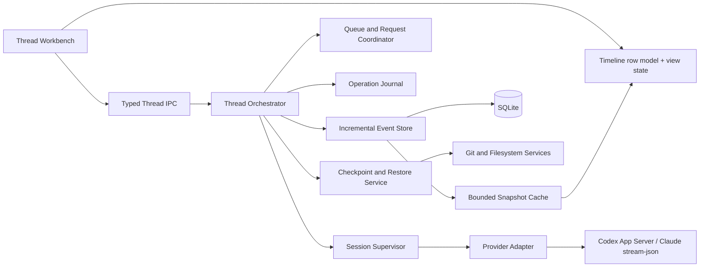

# Thread profissional e resiliente — plano de implementação v2

Data: 2026-09-20
Estado: implementação concluída e certificada no checkout de 2026-09-21
Escopo: modo Thread de Claude e Codex, preservando a identidade visual e os serviços do OXESpace
Referências: implementação atual, `docs/plans/thread-cli-parity/`, Codex Desktop e checkout local `C:\Users\dudu-\Downloads\cdesktop-main\cdesktop-main`

## Conclusão da auditoria

O modo Thread já é funcional e possui uma base incomum para um produto nessa fase: execução headless nativa, subscription auth, requests estruturados, fila, anexos, voz, MCP, evidência de arquivos, workbench, histórico paginado e recuperação de restart/shutdown. O próximo ciclo deve priorizar previsibilidade operacional, desempenho de conversas longas, confiança em retry/undo e clareza de estado.

Adicionar providers ou múltiplas células antes dessa fundação ampliaria o número de estados concorrentes sobre um `ThreadManager` de 851 linhas e um writer que ainda reprocessa o snapshot inteiro. A ordem assertiva é: **contrato e persistência → supervisão e reconciliação → timeline/compositor → checkpoints e ferramentas → subagentes/multissessão → providers e certificação**.

## Avaliação atual

|Dimensão|Estado|Evidência|Lacuna que impede nível profissional|
|---|---|---|---|
|Execução Claude/Codex|Forte|Adapters nativos, streaming, requests, queue/steer, configuração e sessão|Reconexão ainda encerra estados locais; não reconcilia operações com ACK perdido junto ao provider|
|Recovery|Forte|Restart e shutdown encerram turnos/tools/requests/subagentes sem replay automático|Falta journal durável de operação, heartbeat e política por classe de falha|
|Persistência|Intermediário|Eventos/turnos/artefatos em SQLite e paginação segura|Cada write compara e regrava snapshot completo; custo cresce com a conversa|
|Timeline|Intermediário|Markdown GFM, agrupamento de tools, planos, arquivos e subagentes|Sem modelo semântico estável e virtualização; scroll ainda depende do DOM inteiro da janela carregada|
|Troca de Thread|Intermediário|Draft e posição por Thread, refresh com proteção contra respostas tardias|A seleção zera o snapshot até o read; não há follower/cache quente para Threads ativas|
|Compositor e retry|Bom|Modelo/esforço/permissões, voz, anexos, fila e retry de falha recente|Falta máquina de estados única, editar/reexecutar turno anterior e restaurar fila ao draft com configuração original|
|Arquivos e revisão|Bom|Session/Project changes, diff, comentários, editor, Git e autoria explícita|Sem checkpoint verificável, undo transacional ou stream contínuo de mudanças|
|Subagentes|Intermediário|Lifecycle Codex e delegação aparecem na timeline/painel/export|Sem cancel/retry individual e sem contrato equivalente validado no Claude|
|Multissessão|Básico|Várias Threads executam isoladas e aparecem no sidebar|Uma única conversa visível; sem layout de duas/quatro células nem cache ativo limitado|
|Operação e diagnóstico|Intermediário|Falhas estruturadas, usage/reset, diagnostics geral e testes extensos|Sem trace por operação, health de conexão, relatório específico da Thread e SLOs observáveis|
|Providers|Limitado|Claude e Codex qualificados|Demais providers do Code não têm protocolo headless ou adapter certificado|
|Qualidade visual|Boa base|Design system Code, sidebar próprio, composer fixo e workbench|Faltam estados skeleton/empty/error uniformes, virtualização, testes light/dark e auditoria completa de teclado/leitor de tela|

## Princípios obrigatórios

1. SQLite é a fonte canônica local; o provider é a fonte do estado nativo que ele realmente expõe.
2. Toda mutação recebe `operationId`, `threadId`, `turnId`, `generation` e estado terminal. Retry só é automático quando a operação é comprovadamente idempotente.
3. `unknown` permanece um estado de primeira classe. A UI oferece reconciliar, descartar o registro local ou reenviar explicitamente.
4. Paginação e virtualização nunca podem alterar a semântica do histórico ou apagar eventos fora da janela.
5. Undo de arquivo nunca usa `git reset --hard`, `clean` ou sobrescrita cega. Dirty state anterior, hash e conflitos são preservados.
6. Recursos só aparecem habilitados quando o manifesto confirma `supported + authorized + implemented`; descoberta de comando não prova suporte.
7. O design visual continua sendo OXESpace. Da referência cdesktop serão adotados padrões de comportamento: row model semântico, virtualizer, scroll intents, cache/follower e retry com preflight.
8. Nenhuma onda avança sem passar seus gates de fault injection, contratos e regressão Code.

## Arquitetura-alvo

## Ondas e gates

|Onda|Objetivo|Tarefas|Gate para avançar|
|---|---|---|---|
|W0|Fixar SLOs e contratos|T01–T02|Matriz de estados, IDs e compatibilidade aprovada; fault corpus reproduzível|
|W1|Eliminar acoplamento e writes O(n)|T03–T05|100 mil eventos sem perda; restart/disconnect/ACK perdido determinísticos|
|W2|Tornar a conversa fluida|T06–T08|DOM limitado, scroll estável e troca de Thread quente dentro do SLO|
|W3|Dar confiança sobre mudanças|T09–T10|Checkpoint/restore conflituoso é seguro; terminal e diff pertencem ao root correto|
|W4|Completar coordenação|T11–T13|Child lifecycle, import/export e duas células funcionam sem cruzar estado|
|W5|Abrir extensão e certificar|T14–T15|Adapter conformance, pilotos autenticados e release gate aprovados|

## Tarefas detalhadas

### T01 — Definir SLOs, invariantes e fault corpus

- Tipo: research/test; esforço: médio; dependências: nenhuma.
- Criar fixtures para kill durante start, streaming, approval, tool, diff finalization, queue ACK e configuração.
- Medir cold open, warm switch, append de evento, crescimento da timeline, memória e tamanho dos bundles.
- Metas iniciais: append p95 ≤ 15 ms no host Windows de referência; razão p95 entre 1 mil e 100 mil eventos ≤ 2x; troca quente ≤ 150 ms; cold open da janela de 250 eventos ≤ 500 ms; no máximo 80 rows de conversa montadas.
- Aceite: cada estado não terminal possui transição documentada após disconnect, shutdown e restart; benchmark gera JSON versionado.
- Alvos: `tests/integration/thread-faults.test.ts`, `tests/bench/thread-history.bench.ts`, `e2e/thread-performance.spec.ts`, `docs/plans/thread-professional-v2/SLOS.md`.
- Verificação: `npm run typecheck`; testes e benchmark dedicados.

### T02 — Versionar o envelope de evento e operação

- Tipo: design/implement; esforço: alto; dependência: T01.
- Introduzir `ThreadEventEnvelope` com `eventId`, `operationId`, `threadId`, `turnId`, `generation`, `sequence`, timestamps e `schemaVersion`.
- Separar estados de operação (`created`, `sent`, `acknowledged`, `running`, `completed`, `failed`, `cancelled`, `unknown`) dos estados visuais.
- Definir capability/version negotiation por adapter e compatibilidade de leitura com eventos v1.
- Aceite: eventos duplicados e fora de ordem são idempotentes; uma resposta de geração antiga não altera a Thread atual.
- Alvos: `shared/types/thread.ts`, `electron/main/services/conversation/thread-capabilities.ts`, `tests/thread-capabilities.test.ts`, novo `thread-event-envelope.ts`.
- Verificação: testes de ordenação, duplicação, generation mismatch e serialização roundtrip.

### T03 — Decompor o `ThreadManager`

- Tipo: implement; esforço: alto; dependência: T02.
- Manter `ThreadManager` como fachada fina e extrair: `ThreadSessionSupervisor`, `ThreadQueueCoordinator`, `ThreadRequestCoordinator`, `ThreadCommandCoordinator`, `ThreadExportService` e `ThreadRecoveryService`.
- Proibir acesso direto ao snapshot completo fora do event store; cada serviço recebe interfaces mínimas.
- Aceite: fachada ≤ 300 linhas; nenhum ciclo de dependência; comportamento existente preservado.
- Alvos: `electron/main/services/conversation/thread-manager.ts` e novos módulos `thread-*.service.ts`.
- Verificação: suíte atual do manager dividida por serviço mais `madge`/checagem de imports equivalente.

### T04 — Migrar para persistência incremental e journal durável

- Tipo: implement/migration; esforço: alto; dependências: T02–T03.
- Criar migração 055 com identidade estável de evento, revisão, operação e índices por turno/estado/tempo.
- Implementar `appendEvent`, `updateEvent`, `settleOperation`, `updateThreadMetadata` e `rewriteHistory` explícito; remover comparação do histórico completo em writes normais.
- Manter leitura lazy do schema 54 e backup pré-migração existente.
- Aceite: 100 mil eventos; nenhum delete implícito por janela; crash entre duas statements deixa journal recuperável; tamanho e latência seguem T01.
- Alvos: `electron/main/db/migrations/055_thread_operations.sql`, `electron/main/db/index.ts`, `thread-history.ts`, novo `thread-event-store.ts`.
- Verificação: migration upgrade/rollback fixture, property tests e benchmark.

### T05 — Implementar supervisor, heartbeat e reconciliação

- Tipo: implement; esforço: alto; dependência: T04.
- Modelar conexão `starting/connected/degraded/reconnecting/closed` e heartbeat por provider.
- Em reconnect, consultar sessão/turno nativo quando a API permitir; somente então converter `sent/unknown` em estado confirmado.
- Aplicar backoff com jitter e circuit breaker; nunca reexecutar ferramenta, prompt ou approval sem idempotência comprovada.
- Aceite: kill/restart/disconnect em todas as fases converge para um único estado terminal; nenhuma fila é duplicada; UI exibe conexão e próxima ação.
- Alvos: novo `thread-session-supervisor.ts`, adapters Codex/Claude, `thread-runtime.ts`, `ThreadFailureCard.tsx`.
- Verificação: fault injection determinístico e probes nativos sem inferência.

### T06 — Criar timeline semântica e virtualizada

- Tipo: implement; esforço: alto; dependências: T02 e T04.
- Derivar rows estáveis por turno: mensagem, thinking/activity group, tool, plan, diff, request, failure e timing.
- Virtualizar rows com medidas dinâmicas e overscan; manter o turno em streaming como tail controlado.
- Aceite: no máximo 80 rows montadas para 10 mil eventos; expandir tool/diff acima da viewport não provoca salto; busca/jump usa semantic key.
- Alvos: novos `threadTimelineModel.ts`, `useThreadVirtualizer.ts`, `ThreadTimeline.tsx`; reduzir `ThreadView.tsx`.
- Verificação: unit do row model, E2E de 10 mil eventos e teste de resize/expansão.

### T07 — Centralizar a política de scroll e cache de troca rápida

- Tipo: implement; esforço: alto; dependência: T06.
- Criar intents `initial-bottom`, `follow-bottom`, `preserve-anchor`, `plan-reveal`, `jump-to-bottom` e `jump-to-turn`.
- Manter cache LRU limitado das últimas Threads e follower somente para Threads em execução, com teto de sessões/eventos.
- Na seleção, pintar snapshot validado imediatamente e reconciliar em background; nunca mostrar dados de outra geração/root.
- Aceite: troca quente ≤ 150 ms; posição preservada; mensagem nova não rouba scroll; follower respeita teto e libera listeners.
- Alvos: `src/store/thread.store.ts`, novos `threadScrollState.ts`, `threadSnapshotCache.ts`, `threadLiveFollower.ts`.
- Verificação: fake timers, leak checks, troca rápida repetida e E2E de streaming fora da Thread ativa.

### T08 — Formalizar o compositor e retry/edit

- Tipo: implement; esforço: alto; dependências: T05 e T07.
- Criar máquina de estados do compositor para idle, sending, queued, steering, approval, reconnecting e unknown.
- Preservar texto, anexos e configuração por item de fila; cancelar fila restaura tudo ao draft.
- Permitir editar/reexecutar um turno anterior após preflight de branch, dirty state e operações posteriores; o usuário escolhe manter disco ou restaurar checkpoint.
- Aceite: nenhuma ação perde draft; Enter nunca dispara duas operações; retry informa exatamente o que será reexecutado e o efeito no disco.
- Alvos: novo `useThreadComposer.ts`, `ThreadComposer.tsx`, `ThreadPromptQueue.tsx`, `thread.store.ts`.
- Verificação: model-based tests da máquina e E2E de queue/approval/reconnect/edit-retry.

### T09 — Criar checkpoint e restore transacional

- Tipo: implement; esforço: alto; dependências: T04 e T08.
- Capturar base commit, status, hashes e preimages somente dos arquivos tocados, com limites e artefatos imutáveis.
- Planejar restore antes de executar; bloquear conflitos, symlinks fora do root, arquivos alterados depois e evidência truncada.
- Aplicar arquivos via temporário + rename atômico quando suportado; registrar resultado por arquivo e permitir rollback do próprio restore.
- Aceite: dirty anterior é preservado; nenhum comando destrutivo Git; conflitos produzem plano revisável; restore parcial nunca é apresentado como sucesso total.
- Alvos: novos `thread-checkpoints.ts`, `thread-restore.service.ts`, migração complementar se necessária, `ThreadChangesPanel.tsx`.
- Verificação: matrizes tracked/untracked/rename/delete/concurrent edit/symlink/Windows lock.

### T10 — Integrar terminal contextual e diff live ao workbench

- Tipo: implement; esforço: médio/alto; dependências: T05 e T09.
- Adicionar terminal auxiliar do projeto como painel do workbench usando o serviço existente, com owner explícito e root da Thread; ele não assume a sessão do agente.
- Atualizar Project Changes por watcher/debounce e reconciliação periódica, sem polling agressivo.
- Tornar Session Changes o fluxo principal de revisão, com navegação arquivo a arquivo, comentários e ações de checkpoint.
- Aceite: terminal e diff nunca cruzam workspace/worktree; trocar Thread não mata terminal persistente; watchers são liberados.
- Alvos: `ThreadChangesPanel.tsx`, novo `ThreadTerminalPanel.tsx`, `git.service.ts`, `ThreadWorkbench.css`.
- Verificação: integração de dois worktrees com mesmo repositório e E2E de terminal/diff.

### T11 — Completar lifecycle de subagentes

- Tipo: research/implement; esforço: alto; dependência: T05.
- Versionar capabilities para spawn/list/wait/message/interrupt/resume/close/retry por provider.
- Codex: expor controles somente quando a operação nativa existir. Claude: executar probe de contrato; manter indisponível com motivo se não houver API headless.
- Persistir parent/child graph, operação e resultado; impedir ação em child de outra geração.
- Aceite: cancel/retry individual é idempotente e auditável; ausência de suporte não abre CLI nem envia prompt aproximado.
- Alvos: adapters, `ThreadSubagentActivity.tsx`, `ThreadChangesPanel.tsx`, `shared/types/thread.ts`.
- Verificação: contract fixtures e piloto nativo separado por provider.

### T12 — Implementar export/import portátil e seguro

- Tipo: implement; esforço: alto; dependência: T04.
- Definir pacote versionado com manifest, checksums, eventos, turnos, configuração e artefatos redigidos; import é inerte e nunca executa commands/hooks/tools.
- Validar limites, hashes, paths e schema; importar em nova Thread com origem registrada.
- Aceite: export→import→export preserva conteúdo canônico; pacote adulterado ou excessivo é recusado; secrets permanecem redigidos.
- Alvos: novo `thread-portable.ts`, `ThreadConversationActions.tsx`, IPC/preload e testes de segurança.
- Verificação: roundtrip, fuzz de manifest e traversal/zip-bomb equivalents.

### T13 — Oferecer duas células de Thread com isolamento

- Tipo: implement; esforço: alto; dependências: T06–T08.
- Reutilizar o layout de panes do Code para duas células inicialmente; quatro células só após métricas de CPU/memória.
- Cada célula mantém seleção, scroll, draft, anexos, review panel e foco próprios; hotkeys são roteadas pela célula ativa.
- Aceite: duas Threads transmitem simultaneamente sem misturar eventos, comandos, voz ou permissões; fechar uma célula não encerra a execução.
- Alvos: `App.tsx`, `thread-workbench.store.ts`, novo `ThreadGrid.tsx`, `ThreadView.tsx`.
- Verificação: E2E concorrente e testes de foco/voz/approval cruzados.

### T14 — Criar adapter conformance kit e ampliar providers com evidência

- Tipo: design/implement; esforço: alto; dependências: T02 e T05.
- Extrair conformance suite para handshake, streaming, requests, permissions, attachments, queue, interrupt, resume, usage e erro.
- Adicionar provider somente quando existir protocolo headless documentado e subscription auth compatível. CLI TUI/custom arbitrário permanece Code-only.
- Aceite: adapter novo passa a mesma suíte; capability manifest deriva do handshake e dos pilotos, sem flags otimistas.
- Alvos: `agent-conversation-adapter.ts`, `thread-adapter-conformance.ts`, `thread-runtime.ts`, adapters novos por provider.
- Verificação: fixture + probe nativo + piloto autenticado.

### T15 — Observabilidade, acessibilidade e release gate

- Tipo: verify/document; esforço: alto; dependências: T01–T14.
- Correlacionar logs por thread/turn/operation sem registrar prompt, credenciais ou conteúdo privado; criar relatório local de diagnóstico da Thread.
- Executar cada cenário crítico três vezes por provider/versão/plataforma/auth: send, tool, approval, question, queue, interrupt, restart, MCP e arquivo.
- Auditar teclado, foco, leitor de tela, redução de movimento, 900/1280/1440 e temas light/dark.
- Exigir typecheck, lint zero erros, suíte completa, fault suite, migration, build/budgets, E2E, SLO e quality controller com disposição documentada.
- Aceite: nenhum gap P0/P1 aberto; relatório publica matriz `supported/experimental/unavailable` por provider; cinco execuções E2E consecutivas sem flake.
- Alvos: `ThreadDiagnosticsPanel.tsx`, `e2e/thread-view.spec.ts`, novos E2Es, CI e `docs/plans/thread-professional-v2/EVIDENCE.md`.
- Verificação: pipeline completo e revisão visual comparativa.

## Prioridade e estimativa

|Faixa|Tarefas|Resultado|Estimativa|
|---|---|---|---|
|P0|T01–T05|Fundação previsível, escalável e recuperável|4–6 semanas|
|P1|T06–T10|Experiência profissional e segura no uso diário|5–7 semanas|
|P2|T11–T13|Coordenação, portabilidade e multissessão|4–6 semanas|
|P3|T14–T15|Extensão e certificação|3–5 semanas por primeiro provider adicional|

As estimativas assumem uma frente principal, revisão contínua e preservação do checkout atual. W0 e W1 devem sair antes de qualquer expansão visual grande.

## Riscos e mitigação

|Risco|Mitigação|
|---|---|
|Migração corromper histórico existente|Backup pré-migração, leitura v54, shadow write e verificação de contagem/hash antes do cutover|
|Eventos duplicados ou fora de ordem|Envelope estável, unique constraints e reducer idempotente por geração|
|Retry repetir efeito externo|Journal + capability de idempotência; estado `unknown` exige decisão explícita|
|Undo apagar trabalho do usuário|Preflight, hashes/preimages, conflito por arquivo e ausência de comandos destrutivos|
|Virtualização causar saltos|Row keys semânticas, scroll intents puros, medição dinâmica e E2E com expansão acima da viewport|
|Follower consumir recursos|LRU, teto de sessões/eventos, descarte ao finalizar e métricas de listeners/memória|
|Bundle exceder orçamento|Módulos lazy por workbench, imports dinâmicos e meta de pelo menos 5% de margem em main/renderer|
|Provider mudar protocolo|Handshake versionado, schema fixtures e capability downgrade explícito|
|Multicélula misturar contexto|Store por cellId, owner/generation em toda IPC e testes concorrentes de isolamento|

## Critérios globais de conclusão

1. Nenhum turno, tool, request, queue item ou child permanece em estado impossível após crash, restart, disconnect ou troca de Thread.
2. Histórico de 100 mil eventos mantém integridade, paginação e latência sem writes proporcionais ao tamanho total.
3. Timeline longa monta no máximo 80 rows e preserva a posição durante streaming, prepend e expansão.
4. Retry, rewind e restore informam separadamente efeito na conversa, provider e disco.
5. Duas Threads podem executar e permanecer visíveis sem cruzar root, sessão, permissões, voz, draft ou eventos.
6. Toda capacidade exibida possui evidência `native` ou `pilot`; experimental e unavailable continuam explícitos.
7. O modo Code continua passando regressão e mantém terminais/panes vivos ao alternar para Thread.

## Primeiro incremento recomendado

Executar T01–T05 como um único milestone de fundação. Esse corte resolve o maior risco técnico atual, cria métricas reais e reduz o custo das ondas visuais. A primeira entrega demonstrável deve ser: conversa de 100 mil eventos, kill em seis fases distintas, restart e reconciliação sem duplicação, com append incremental e relatório de operação.
